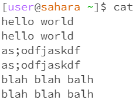

# Lab 1
## No Arguments
\
The command was run in the `home` directory with no output. Additionally, the working directory did not change because I did not specify a directory to change into. An error did not occur since the command is equivalent to `cd .`, which just changes directory into the working directory.\
\
The command was run in the `home` directory. The reason I got this output is because I asked to see all the files and folders in the `home` directory, where only the `lecture1` folder was present. There were no errors with this command.\
\
The command was run in the `home` directory. There was not output, but the program did not end automatically. Instead it let me type my own output and would repeat it whenever I hit the return key. There were no errors.
## Directory
\
The command was run in the `home` directory. There was no output, but the working directory was changed to `lecture1`, because that was the directory I chose to change into. No errors occurred.\
\
The command was run in the `home` directory. The output showed all the files and directories in the `lecture1` directory, since I asked to display everything in `lecture1`. No errors occurred.\
\
The command was run in the `home` directory. The output says that lecture1 is a directory. An error did occur since `cat` can only be run on files with readable text in it.
## File
\
The command was run in the `lecture1` directory. The output shows that it was unable to change directory into a file. An error occurred because you can't use `cd` on a file, only on a directory.\
\
The command was run in the `lecture1` directory. The output shows only the file the command was used on, because there are no other files or directories within the `Hello.java` file. No errors occurred.\
\
The command was run in the `lecture1` directory. The output shows the contents of the `Hello.java` file. No errors occurred.
