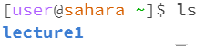
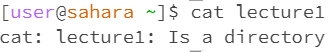
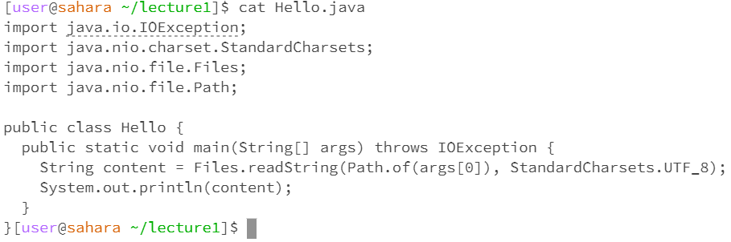

## No Arguments
\
The command was run in the home directory with no output. The reason I got this output was because I did not specify a directory to change into. An error did occur since you're supposed to have another argument include with `cd`.\
\
The command was run in the home directory. The reason I got this output is because I asked to see all the files and folders in the home directory, where only the `lecture1` folder was present. There were no errors with this command.\
\
The command was run in the home directory. There was not output, but the program did not end automatically. Instead it 
## Directory
\
\

## File
\
\

