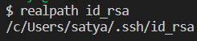
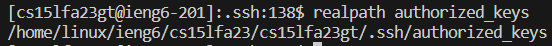
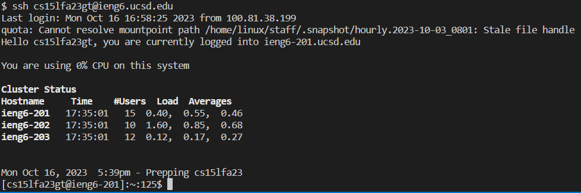

# Lab 2
## Part 1
```
import java.io.IOException;
import java.net.URI;

class Handler implements URLHandler {
    String s = "";
    int counter = 0;

    public String handleRequest(URI url) {
        if (url.getPath().equals("/add-message")) {
            counter += 1;
            String[] parameters = url.getQuery().split("=");
            if (parameters[0].equals("s")) {
                if (counter == 1) {
                    s += String.format("%d", counter) + ". " + parameters[1];
                }
                else {
                    s += "\n" + String.format("%d", counter) + ". " + parameters[1]; 
                }
                return s;
            }
        }
        return "404 not found!";
    }
}

class StringServer {
    public static void main(String[] args) throws IOException {
        if(args.length == 0){
            System.out.println("Missing port number! Try any number between 1024 to 49151");
            return;
        }

        int port = Integer.parseInt(args[0]);

        Server.start(port, new Handler());
    }
}
``` 
\
The `handleRequest` method is called. The only argument for the method is `URI url`, whose value is currently `localhost:3000/add-message?s=Hello`. The value of `s` is changed from `""` to `1. Hello`. Additionaly, the `counter` variable is incremented from 0 to 1.\
\
The `handleRequest` method is called again. The same single argument for the method is `URI url`, whose values is changed to `localhost:3000/add-message?s=How are you`. Additionally the value of `s` is changed to `1. Hello\n2. How are you` and the `counter` variable is incremented from 1 to 2.
## Part 2
\
The absolute path of the private key file on my personal computer.\
\
The absolute path of the file that contains the public key for logging into my account. The file path is shown in the `ieng6` server.\
\
Logging into `ieng6` without needing the enter my password.
## Part 3
Something new that I learned from this lab was how to save my passwords for remote servers I want to `ssh` into. I think this is very useful to know since it can save me time when logging in as well as save memory in my brain so I don't have to remember the password. I think it will be helpful to remember this skill for the future.
