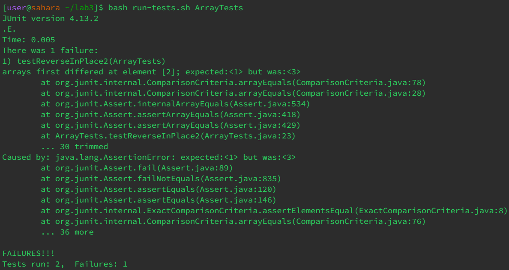

# Lab 3
## Part 1
Failure-inducing test:
```
@Test
public void testReverseInPlace2() {
  int[] input = { 1, 2, 3 };
  ArrayExamples.reverseInPlace(input);
  assertArrayEquals(new int[] { 3, 2, 1 }, input);
}
```
Input that does not fail:
```
@Test 
public void testReverseInPlace() {
  int[] input1 = { 3 };
  ArrayExamples.reverseInPlace(input1);
  assertArrayEquals(new int[]{ 3 }, input1);
}
```
Symptom showing up after running the tests:

Before fixing the bug:
```
static void reverseInPlace(int[] arr) {
  for(int i = 0; i < arr.length; i += 1) {
    arr[i] = arr[arr.length - i - 1];
  }
}
```
After fixing the bug:
```
static void reverseInPlace(int[] arr) {
  for(int i = 0; i < arr.length/2; i += 1) {
    int temp = arr[i];
    arr[i] = arr[arr.length - i - 1];
    arr[arr.length - i - 1] = temp;
  }
}
```
The change fixes the issue because it makes it so two elements are being swapped rather than one element being changed to another element. Additionally, the loop only goes through half of the array since swapping while iterating through the second half of the array would just return it back to its original state.
## Part 2
`grep -i` Examples:\
\
The command is searching for instances of the string "UNEsco" in each line while ignoring case. The only lines returned show the string "UNESCO", which only match the string being looked for when ignoring case.
\
The command is searching for instances of the string "es CELL" while ignoring case. All the lines returned contained the string "ES cell", showing how case was ignored.\
`grep -c` Examples:\
\
The command is counting every line that contains the string "A-GVHD", where it shows there were 52 lines that contained the string. This command does not return the number of times the string appears.\
\
The command is counting every line that contains the string "the" in every .txt file in the `plos` directory. It shows the count for every file in a list.\
`grep -w` Examples:\
\
The command only returns lines that contain the word "class" rather than any lines that may contain the string "class" as a substring. There was an instance of the word "classes" that was ignored.\
\
The command searches for lines that contain the string "path" that is not a substring. There were instances of the word sympathetic that were ignored.\
`grep -o` Examples:\
\
The command lists every instance of the string "and" while ignoring the rest of the line.\
\
The command lists every instance of the string "Was" while ignoring the rest of the line.\
All of the commands used were found at this [link](https://www.geeksforgeeks.org/grep-command-in-unixlinux/).
