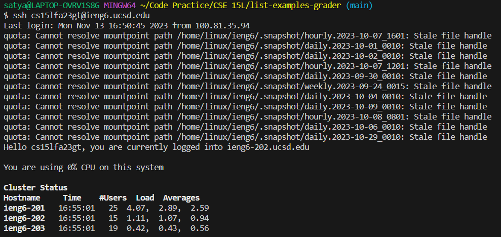
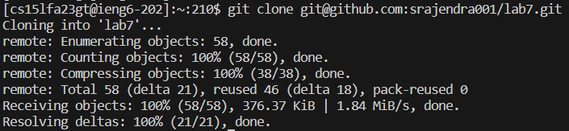
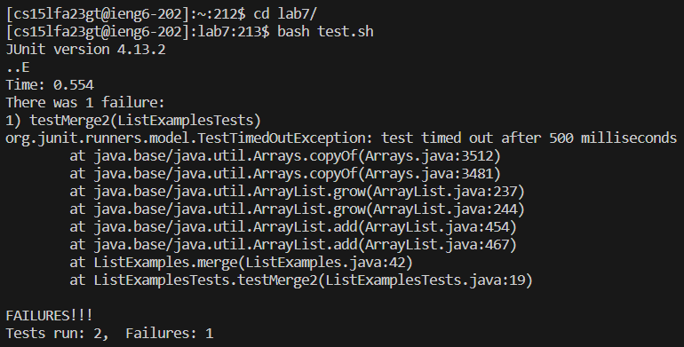
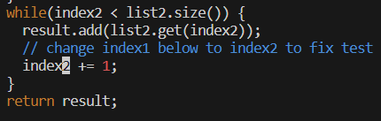
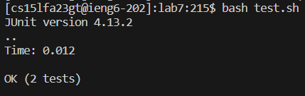
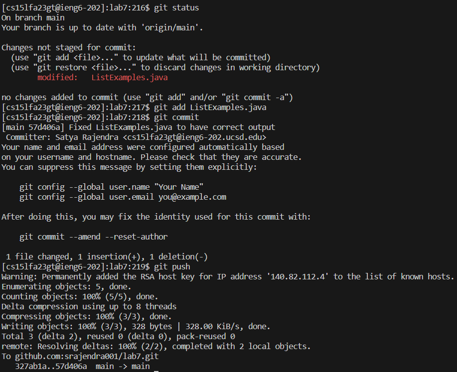

# Lab 4
\
The keys pressed for this command were `ssh cs15lfa23gt@ieng6.ucsd.edu<enter>`. This command was used to log me in to the ieng6 server.\
\
The keys pressed for this command were `git clone <ctrl+v><enter>`. This command clones the repository, where `git@github.com:srajendra001/lab7.git` was what was copied from the clipboard.\
\
The keys pressed for this command were `bash t<tab><enter>`, which ran the tests. Using the `<tab>` button autocompleted the t character to `test.sh`.\
\
The keys pressed for this command were `vim L<tab>.<tab><enter>`, `?index1<enter>`, and `er2:wq<enter>`. This set of commands opened the `ListExamples.java` file in vim, searched for the last instance of `index1`, moved the cursor to the last character in the word and replaced it with a 2, and finally saved and exited from vim.\
\
The keys pressed for this command were `<up><up><enter>`. Doing this finds the bash history 2 lines up, which was `bash test.sh`, and runs the tests.\
\
The keys pressed for this set of commands were `git status<enter>`, `git add <tab><enter>`, `git commit<enter>`, `<shift+g>i<del>Fixed ListExamples.java to have correct output<esc>:wq<enter>`, and `git push <enter>`. First, the current status was checked. Then, the `ListExamples.java` file was staged to be committed. It was committed using vim to create a special commit message for GitHub. Finally, the commit was pushed to the remote repository to reflect the changes made on the local computer.
