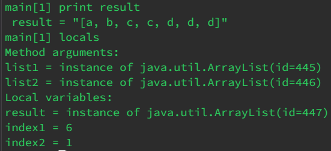

# Lab 5
## Part 1
1) **Student**: Can someone help me figure out what's wrong with my `merge` function? I think the bug might related to the second List but I'm not fully sure. Here's a picture of my code for the function as well as the tests that I ran.\
  \
  
2) **TA**: It seems like you're on the right track. Maybe try stopping in the `merge` function and see what's going on using jdb. Also write out what you think should be happening before running the debugger so you can see exactly where the issue is.\
3) **Student**: I noticed that once I completed adding all the elements of `list1`, there was an issue with how I was adding the remaining elements from `list2`. In the debugger I noticed that the `index2` variable wasn't being updated correctly. Additonally, the program kept adding the second element in `list2` to the `result` array since `index2` wasn't being incremented.\
   \
4) Here's the directory structure that I used. I added the `debug.sh` file to make it easier to run the debugger.\


`ListExamples.java`:
```
import java.util.ArrayList;
import java.util.List;

interface StringChecker { boolean checkString(String s); }

class ListExamples {

  // Returns a new list that has all the elements of the input list for which
  // the StringChecker returns true, and not the elements that return false, in
  // the same order they appeared in the input list;
  static List<String> filter(List<String> list, StringChecker sc) {
    List<String> result = new ArrayList<>();
    for(String s: list) {
      if(sc.checkString(s)) {
        result.add(0, s);
      }
    }
    return result;
  }


  // Takes two sorted list of strings (so "a" appears before "b" and so on),
  // and return a new list that has all the strings in both list in sorted order.
  static List<String> merge(List<String> list1, List<String> list2) {
    List<String> result = new ArrayList<>();
    int index1 = 0, index2 = 0;
    while(index1 < list1.size() && index2 < list2.size()) {
      if(list1.get(index1).compareTo(list2.get(index2)) < 0) {
        result.add(list1.get(index1));
        index1 += 1;
      }
      else {
        result.add(list2.get(index2));
        index2 += 1;
      }
    }
    while(index1 < list1.size()) {
      result.add(list1.get(index1));
      index1 += 1;
    }
    while(index2 < list2.size()) {
      result.add(list2.get(index2));
      // change index1 below to index2 to fix test
      index1 += 1;
    }
    return result;
  }


}
```
`ListExamplesTests.java`:
```
import static org.junit.Assert.*;
import org.junit.*;
import java.util.*;
import java.util.ArrayList;


public class ListExamplesTests {
  @Test(timeout = 500)
  public void testMerge1() {
        List<String> l1 = new ArrayList<String>(Arrays.asList("x", "y"));
    List<String> l2 = new ArrayList<String>(Arrays.asList("a", "b"));
    assertArrayEquals(new String[]{ "a", "b", "x", "y"}, ListExamples.merge(l1, l2).toArray());
  }
  
  @Test(timeout = 500)
        public void testMerge2() {
    List<String> l1 = new ArrayList<String>(Arrays.asList("a", "b", "c"));
    List<String> l2 = new ArrayList<String>(Arrays.asList("c", "d", "e"));
    assertArrayEquals(new String[]{ "a", "b", "c", "c", "d", "e" }, ListExamples.merge(l1, l2).toArray());
        }

}
```
To trigger the bug I just ran `bash test.sh`, which showed that there was an error in my program since I failed on of the tests.\
To fix the bug, I just had to change `index1` to `index2` in the last while loop in the `merge` function.
## Part 2
Something that I learned about from these labs was how to write bash scripts. It's been really useful for every lab after I learned how to do it. Scripting has made a lot of tedious actions very easy to complete, such as compiling and running tests. I think this skill is something I plan on using very frequently for the rest of my CS career.  
